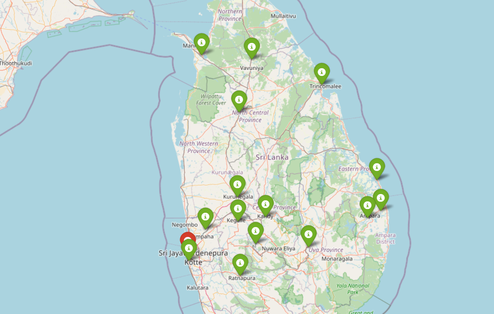

#  ATI_Map of Sri Lanka

## Project Overview

This project aims to create an interactive map that displays all institutes of Advanced Technological Institute (ATI) in Sri Lanka. The map is visualized using the Folium Python library, which provides a powerful way to create web-based interactive maps.

## Features

* Interactive map with Institute locations
* Easy navigation and zooming capabilities

## Requirements

* Python 3.x
* Folium library (install using `pip install folium`)

## Installation and usage 

1. Clone this repository using `git clone https://github.com/vanu888/ATI_Map.git`
2. Install the required libraries by running `pip install folium`
3. Open the `ATI-map.html` file in a web browser to view the interactive map

## Contributing

Contributions are welcome! If you like to add more or improve the map’s design, please fork this repository and submit a pull request       

